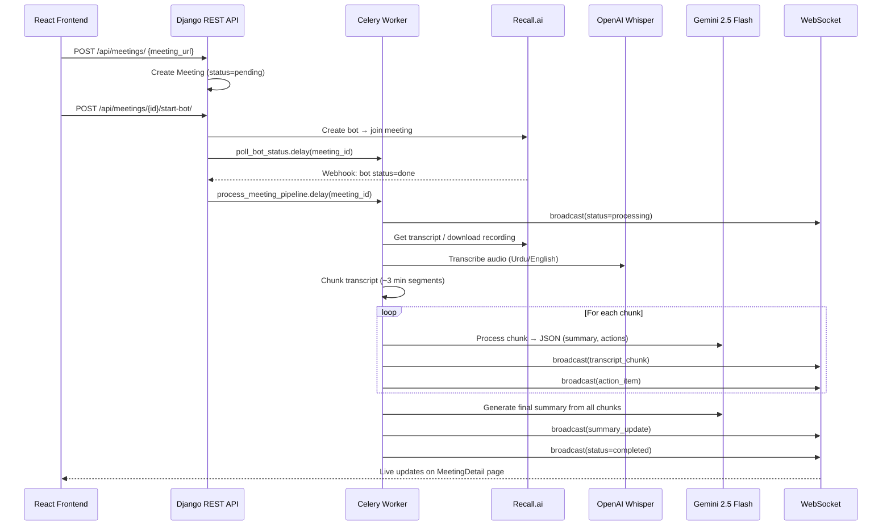

# Autonomous Multilingual AI Meeting Summarizer — Complete Codebase Documentation

## 1. Project Overview

This is a **full-stack web application** that deploys an autonomous bot to Google Meet/Zoom, captures audio, transcribes it (handling Urdu/English code-switching), and uses an LLM to extract structured summaries and action items.

**Tech Stack:**
- **Backend:** Django 4.2 + Django REST Framework + Celery + Redis + MySQL
- **Frontend:** React 19 + Tailwind CSS v4 + Vite
- **LLM:** Google Gemini 2.5 Flash (via LangChain) with OpenAI GPT-4o fallback
- **Bot:** Recall.ai API (joins meetings, records audio)
- **Transcription:** OpenAI Whisper API
- **Real-time:** Django Channels (WebSockets) + Redis

---

## 2. Project Directory Structure

```
NLPproject/
├── .gitignore
├── backend/
│   ├── .env                          # Environment variables (secrets, DB, API keys)
│   ├── .env.example                  # Template for .env
│   ├── manage.py                     # Django entry point
│   ├── requirements.txt              # Python dependencies
│   ├── venv/                         # Python virtual environment (not in git)
│   ├── config/                       # Django project configuration
│   │   ├── __init__.py               # Loads Celery app on startup
│   │   ├── settings.py               # All Django settings
│   │   ├── urls.py                   # Root URL routing
│   │   ├── asgi.py                   # ASGI config (HTTP + WebSocket)
│   │   ├── wsgi.py                   # WSGI config (HTTP only)
│   │   └── celery.py                 # Celery app configuration
│   ├── accounts/                     # User auth app
│   │   ├── models.py                 # Custom User model
│   │   ├── serializers.py            # Register/Login/Profile serializers
│   │   ├── views.py                  # Auth API views
│   │   ├── urls.py                   # Auth URL routes
│   │   └── admin.py                  # User admin config
│   └── meetings/                     # Core meetings app
│       ├── models.py                 # Meeting, ActionItem, TranscriptChunk
│       ├── serializers.py            # CRUD serializers
│       ├── views.py                  # API ViewSets + webhook
│       ├── urls.py                   # Meeting API routes
│       ├── webhook_urls.py           # Recall.ai webhook (unauthenticated)
│       ├── tasks.py                  # Celery async pipeline
│       ├── consumers.py              # WebSocket consumer
│       ├── routing.py                # WebSocket URL routing
│       ├── broadcast.py              # WS broadcast utility
│       ├── admin.py                  # Meeting admin with inlines
│       ├── services/                 # Business logic layer
│       │   ├── __init__.py           # Re-exports all services
│       │   ├── recall_service.py     # Recall.ai API client
│       │   ├── transcription_service.py  # Whisper + chunking
│       │   └── llm_service.py        # LangChain + Gemini/GPT-4o
│       └── management/commands/
│           └── test_pipeline.py      # CLI pipeline test command
└── frontend/
    ├── index.html                    # HTML entry point
    ├── package.json                  # npm dependencies
    ├── vite.config.js                # Vite + Tailwind + API proxy
    └── src/
        ├── main.jsx                  # React entry point
        ├── App.jsx                   # Router + auth provider
        ├── index.css                 # Design system (glassmorphism, animations)
        ├── api/
        │   └── client.js             # Axios + JWT interceptors
        ├── context/
        │   └── AuthContext.jsx        # Auth state management
        ├── hooks/
        │   └── useWebSocket.js        # WebSocket hook
        ├── components/
        │   ├── Layout.jsx             # Sidebar + main shell
        │   ├── ProtectedRoute.jsx     # Auth guard
        │   ├── MeetingCard.jsx        # Meeting card component
        │   ├── NewMeetingModal.jsx     # Create meeting modal
        │   └── ActionItemList.jsx     # Action items with checkboxes
        └── pages/
            ├── Login.jsx              # Login page
            ├── Register.jsx           # Registration page
            ├── Dashboard.jsx          # Meeting list + stats
            └── MeetingDetail.jsx      # Full meeting view (tabbed)
```

---

## 3. End-to-End Data Flow



---

## 4. Backend Files — Detailed Breakdown

### 4.1 `config/` — Project Configuration

#### `config/settings.py`
**Purpose:** Central Django configuration file.
**Key sections:**
- `INSTALLED_APPS`: Includes `daphne`, `channels`, `rest_framework`, `corsheaders`, `django_filters`, `accounts`, `meetings`
- `DATABASES`: MySQL (production) with env vars for credentials
- `REST_FRAMEWORK`: Default JWT auth, pagination (20/page), filter backends
- `SIMPLE_JWT`: Access token = 1 hour, Refresh token = 7 days
- `CELERY_*`: Redis broker at `redis://127.0.0.1:6379/0`
- `CHANNEL_LAYERS`: Redis-backed channel layer for WebSockets
- `CORS_ALLOW_ALL_ORIGINS = True` (dev mode)
- API keys: `OPENAI_API_KEY`, `GOOGLE_API_KEY`, `RECALL_AI_API_KEY`

**Connections:** Every other file reads settings from here.

#### `config/urls.py`
**Purpose:** Root URL dispatcher. Maps URL prefixes to apps.
**Routes:**
| URL Pattern | Destination | Auth |
|---|---|---|
| `/admin/` | Django admin | Session |
| `/api/accounts/` | `accounts.urls` | See below |
| `/api/meetings/` | `meetings.urls` | JWT |
| `/api/token/refresh/` | SimpleJWT refresh | Public |
| `/api/webhooks/` | `meetings.webhook_urls` | Public |

#### `config/__init__.py`
**Purpose:** Ensures Celery app is loaded when Django starts.
**Code:** `from .celery import app as celery_app`
**Why:** Without this, Celery wouldn't auto-discover tasks from `meetings/tasks.py`.

#### `config/celery.py`
**Purpose:** Configures the Celery application.
**Key logic:**
- Sets `DJANGO_SETTINGS_MODULE`
- Creates `Celery('config')` app
- Calls `app.autodiscover_tasks()` — this finds `meetings/tasks.py` automatically
**Connections:** Used by `config/__init__.py`, reads from `settings.CELERY_*`.

#### `config/asgi.py`
**Purpose:** ASGI entrypoint for both HTTP and WebSocket traffic.
**Key logic:**
- `ProtocolTypeRouter` splits traffic:
  - HTTP → standard Django ASGI app
  - WebSocket → `URLRouter(meetings.routing.websocket_urlpatterns)`
**Connections:** Imports `meetings/routing.py`.

#### `config/wsgi.py`
**Purpose:** Standard WSGI entrypoint (used by Gunicorn in production, not used in dev with Daphne).

---

### 4.2 `accounts/` — User Authentication App

#### `accounts/models.py`
**Purpose:** Custom User model using **email** as the login field.
**Model: `User`** (extends `AbstractUser`)
- `email` — EmailField, unique, used as `USERNAME_FIELD`
- Inherits: `username`, `password` (hashed), `date_joined`, `is_staff`, etc.
- Table name: `users`
**Connections:** Referenced by `Meeting.user` (ForeignKey), used by all auth logic.

#### `accounts/serializers.py`
**Purpose:** Converts User data between Python objects and JSON.
**Classes:**
- `RegisterSerializer` — Validates email/username/password, calls `create_user()` (auto-hashes password)
- `UserSerializer` — Read-only profile (id, email, username, date_joined)
- `CustomTokenObtainPairSerializer` — Extends JWT login to include user profile in response
**Connections:** Used by `accounts/views.py`.

#### `accounts/views.py`
**Purpose:** API endpoints for auth.
**Endpoints:**
| Class | Method | URL | What it does |
|---|---|---|---|
| `RegisterView` | POST | `/api/accounts/register/` | Creates new user |
| `LoginView` | POST | `/api/accounts/login/` | Returns JWT tokens + user data |
| `ProfileView` | GET | `/api/accounts/profile/` | Returns logged-in user's profile |
**Connections:** Uses serializers, returns JWT tokens.

#### `accounts/urls.py`
**Purpose:** Maps `/register/`, `/login/`, `/profile/` to views.
**Connections:** Included by `config/urls.py` under `/api/accounts/`.

#### `accounts/admin.py`
**Purpose:** Registers User model in Django admin with custom display.

---

### 4.3 `meetings/` — Core Application

#### `meetings/models.py`
**Purpose:** Database schema for meetings, action items, and transcript chunks.

**Model: `Meeting`**
| Field | Type | Purpose |
|---|---|---|
| `user` | ForeignKey(User) | Owner of the meeting |
| `meeting_url` | URLField | Google Meet / Zoom link |
| `title` | CharField | Auto-generated or user-set title |
| `date` | DateTimeField | When meeting was created |
| `status` | CharField (choices) | `pending` → `bot_joining` → `in_progress` → `processing` → `completed` / `failed` |
| `bot_id` | CharField | Recall.ai bot UUID |
| `full_transcript` | TextField | Complete raw transcript |
| `final_summary` | TextField | LLM-generated summary |

**Model: `ActionItem`**
| Field | Type | Purpose |
|---|---|---|
| `meeting` | ForeignKey(Meeting) | Parent meeting |
| `assigned_speaker` | CharField | Who is responsible |
| `task_description` | TextField | What needs to be done |
| `deadline` | CharField | When (if mentioned) |
| `is_completed` | BooleanField | Toggle status |

**Model: `TranscriptChunk`**
| Field | Type | Purpose |
|---|---|---|
| `meeting` | ForeignKey(Meeting) | Parent meeting |
| `chunk_index` | IntegerField | Order of the chunk |
| `raw_text` | TextField | Original transcript segment |
| `processed_json` | JSONField | LLM output (summary, decisions, actions) |
| `timestamp_start/end` | FloatField | Time range in seconds |

**Connections:** Used by serializers, views, tasks, admin.

#### `meetings/serializers.py`
**Purpose:** JSON serialization for the API.
**Classes:**
- `MeetingListSerializer` — Lightweight list view (includes `action_item_count`)
- `MeetingDetailSerializer` — Full view with nested `action_items` and `transcript_chunks`
- `MeetingCreateSerializer` — For creating meetings (auto-assigns `request.user`)
- `ActionItemSerializer` — CRUD for action items
- `TranscriptChunkSerializer` — Read-only chunk data

#### `meetings/views.py`
**Purpose:** API endpoints for meetings and action items.
**Key ViewSets:**

**`MeetingViewSet`:**
| Action | Method | URL | What it does |
|---|---|---|---|
| list | GET | `/api/meetings/` | List user's meetings |
| create | POST | `/api/meetings/` | Create a meeting |
| retrieve | GET | `/api/meetings/{id}/` | Get full meeting detail |
| destroy | DELETE | `/api/meetings/{id}/` | Delete a meeting |
| start_bot | POST | `/api/meetings/{id}/start-bot/` | Deploy Recall.ai bot |
| reprocess | POST | `/api/meetings/{id}/reprocess/` | Re-run LLM pipeline |

**`ActionItemViewSet`:**
| Action | Method | URL | What it does |
|---|---|---|---|
| list | GET | `/api/meetings/action-items/` | List action items |
| toggle_complete | POST | `/api/meetings/action-items/{id}/toggle-complete/` | Toggle done status |

**`recall_webhook`** (function view):
- POST `/api/webhooks/recall/` — Receives bot status from Recall.ai, triggers pipeline.
**Connections:** Uses all serializers, calls RecallService, triggers Celery tasks.

#### `meetings/urls.py`
**Purpose:** DRF router auto-generates RESTful URLs for both ViewSets.

#### `meetings/webhook_urls.py`
**Purpose:** Separate URL file for unauthenticated webhook endpoint.

---

### 4.4 `meetings/services/` — Business Logic Layer

#### `services/__init__.py`
**Purpose:** Re-exports `RecallService`, `TranscriptionService`, `LLMService` so other files can do `from meetings.services import LLMService`.

#### `services/recall_service.py` — Recall.ai Integration
**Purpose:** Manages meeting bots via the Recall.ai REST API.
**Key methods:**
| Method | What it does |
|---|---|
| `create_bot(meeting_url)` | Sends POST to Recall.ai → returns bot_id |
| `get_bot_status(bot_id)` | Polls bot status (joining, in_call, done) |
| `get_transcript(bot_id)` | Gets real-time transcript from Recall |
| `download_recording(bot_id)` | Downloads MP4/audio file for Whisper |
**Connections:** Called by `views.py` (start_bot) and `tasks.py` (pipeline).

#### `services/transcription_service.py` — Whisper + Chunking
**Purpose:** Converts audio to text and splits transcripts into processable chunks.
**Key methods:**
| Method | What it does |
|---|---|
| `transcribe_audio(file_path)` | Sends audio to OpenAI Whisper API with Urdu/English prompt |
| `assemble_recall_transcript(raw_data)` | Converts Recall.ai's JSON transcript into plain text |
| `chunk_transcript(text, chunk_duration=180)` | Splits text into ~3-minute segments |
**Code-switching handling:** Whisper is prompted with `"This audio contains a mix of English and Urdu (Roman Urdu). Transcribe everything as spoken."` 
**Connections:** Called by `tasks.py`.

#### `services/llm_service.py` — LLM Pipeline (Gemini / GPT-4o)
**Purpose:** Processes transcript chunks through an LLM for structured extraction.
**Provider selection:** Auto-detects based on `.env` keys:
1. `GOOGLE_API_KEY` present → **Gemini 2.5 Flash** (free tier)
2. `OPENAI_API_KEY` present → **GPT-4o** (paid)
3. Neither → raises error

**Pydantic schemas (guarantee JSON structure):**
- `ChunkProcessingOutput`: english_translation, summary, key_decisions, action_items, speakers
- `FinalSummaryOutput`: title, executive_summary, key_topics, detailed_summary, overall_action_items
- `ActionItemOutput`: assigned_to, task, deadline

**Key methods:**
| Method | Input | Output |
|---|---|---|
| `process_chunk(raw_text, chunk_index)` | Raw transcript chunk | Structured JSON with summary + action items |
| `generate_final_summary(chunk_summaries)` | List of chunk results | Final meeting summary with consolidated action items |

**Retry logic:** Both methods retry up to 3 times with 25s/50s backoff on 429 (rate limit) errors.
**Connections:** Called by `tasks.py`.

---

### 4.5 `meetings/tasks.py` — Celery Async Pipeline

**Purpose:** Orchestrates the entire processing pipeline asynchronously.

**Task: `process_meeting_pipeline(meeting_id)`**
```
Step 1: Fetch transcript from Recall.ai (or use existing)
Step 2: Chunk transcript into ~3-minute segments
Step 3: Process each chunk through LLM
         → Save TranscriptChunk to DB
         → Save ActionItems to DB
         → Broadcast to WebSocket clients
Step 4: Generate final summary from all chunk results
         → Save to Meeting.final_summary
         → Broadcast summary + status=completed
```

**Task: `poll_bot_status(meeting_id, bot_id)`**
Polls Recall.ai every 30 seconds until the bot finishes recording, then triggers `process_meeting_pipeline`.

**Connections:** Imports all 3 services, uses `broadcast.py`, updates models.

### 4.6 `meetings/consumers.py` — WebSocket Consumer
**Purpose:** Handles WebSocket connections for live meeting updates.
**URL:** `ws://host:8000/ws/meetings/<meeting_id>/`
**Events received by frontend:**
| Event Type | When Sent | Data |
|---|---|---|
| `status_change` | Bot joins, processing starts/ends | `{status: "processing"}` |
| `transcript_chunk` | Each chunk processed | `{chunk_index, summary}` |
| `action_item` | Each action item extracted | `{id, assigned_speaker, task_description}` |
| `summary_update` | Final summary generated | `{summary: "..."}` |
**Connections:** Receives events from `broadcast.py` via Redis channel layer.

### 4.7 `meetings/routing.py`
**Purpose:** Maps WebSocket URL pattern to `MeetingConsumer`.
**Connections:** Imported by `config/asgi.py`.

### 4.8 `meetings/broadcast.py`
**Purpose:** Utility function to send messages from sync Celery tasks to async WebSocket clients.
**Key function:** `broadcast_to_meeting(meeting_id, event_type, data)` — uses `async_to_sync(channel_layer.group_send)`.
**Connections:** Called by `tasks.py`, sends to `consumers.py`.

### 4.9 `meetings/management/commands/test_pipeline.py`
**Purpose:** CLI command to test the full LLM pipeline with a sample Urdu/English transcript without needing a real meeting.
**Usage:** `python manage.py test_pipeline`
**What it does:** Creates a test meeting → chunks sample transcript → runs LLM → saves results.

---

## 5. Frontend Files — Detailed Breakdown

### 5.1 Configuration

#### `vite.config.js`
**Purpose:** Vite build config with Tailwind CSS v4 plugin and API proxy.
**Key config:** Proxies `/api/*` requests to `http://127.0.0.1:8000` (Django backend).

#### `index.html`
**Purpose:** HTML entry point with SEO meta tags. Loads `src/main.jsx`.

#### `src/index.css`
**Purpose:** Complete design system using CSS custom properties.
**Design tokens:** Surface colors (dark navy), accent gradients (indigo→violet), status colors.
**Component classes:** `.glass-card`, `.btn-accent`, `.btn-secondary`, `.input-field`, `.badge-*`, `.skeleton`
**Animations:** `fadeInUp`, `pulse-glow`, `shimmer` (loading skeleton)

### 5.2 App Shell

#### `src/main.jsx`
**Purpose:** React entry point. Renders `<App />` inside `<StrictMode>`.

#### `src/App.jsx`
**Purpose:** Sets up routing and auth provider.
**Route map:**
| Path | Component | Protected |
|---|---|---|
| `/login` | `<Login />` | No |
| `/register` | `<Register />` | No |
| `/dashboard` | `<Layout><Dashboard /></Layout>` | Yes |
| `/meetings` | `<Layout><Dashboard /></Layout>` | Yes |
| `/meetings/:id` | `<Layout><MeetingDetail /></Layout>` | Yes |
| `*` | Redirect to `/dashboard` | — |

### 5.3 API Layer

#### `src/api/client.js`
**Purpose:** Axios HTTP client with JWT handling.
**Features:**
- **Request interceptor:** Attaches `Authorization: Bearer <token>` to every request
- **Response interceptor:** On 401, auto-refreshes token using refresh token, retries request
- **Exported functions:** `registerUser`, `loginUser`, `getProfile`, `getMeetings`, `getMeeting`, `createMeeting`, `deleteMeeting`, `startBot`, `reprocessMeeting`, `getActionItems`, `toggleActionItem`
**Connections:** Used by every page and context.

### 5.4 State Management

#### `src/context/AuthContext.jsx`
**Purpose:** React Context for auth state (user, loading, login, register, logout).
**On mount:** Checks localStorage for existing JWT → calls `/api/accounts/profile/` to restore session.
**`login(email, password)`:** Calls API → stores tokens in localStorage → sets user state.
**`logout()`:** Clears localStorage → sets user to null.
**Connections:** Used by `Login.jsx`, `Register.jsx`, `Layout.jsx`, `ProtectedRoute.jsx`.

### 5.5 Hooks

#### `src/hooks/useWebSocket.js`
**Purpose:** Custom hook for WebSocket connection to a meeting.
**Features:** Auto-connects to `ws://localhost:8000/ws/meetings/{id}/`, auto-reconnects on disconnect (3s delay).
**Returns:** `{ connected: boolean }`
**Connections:** Used by `MeetingDetail.jsx`.

### 5.6 Components

#### `src/components/Layout.jsx`
**Purpose:** App shell with sidebar navigation.
**Contains:** Logo, nav links (Dashboard, Meetings), user avatar + email, logout button.
**Connections:** Wraps all protected pages in `App.jsx`. Uses `AuthContext`.

#### `src/components/ProtectedRoute.jsx`
**Purpose:** Redirects to `/login` if user is not authenticated. Shows spinner while loading.

#### `src/components/MeetingCard.jsx`
**Purpose:** Glass card showing meeting title, status badge, date, and action item count.
**Behavior:** Clicking navigates to `/meetings/{id}`.

#### `src/components/NewMeetingModal.jsx`
**Purpose:** Modal form for creating a new meeting (URL + optional title).
**Connections:** Calls `createMeeting()` from `client.js`.

#### `src/components/ActionItemList.jsx`
**Purpose:** Renders action items with toggleable checkboxes.
**Behavior:** Clicking checkbox calls `toggleActionItem()` API.

### 5.7 Pages

#### `src/pages/Login.jsx`
**Purpose:** Email/password login form with gradient logo.
**Flow:** Calls `auth.login()` → navigates to `/dashboard`.

#### `src/pages/Register.jsx`
**Purpose:** Registration form (email, username, password, confirm).
**Flow:** Calls `auth.register()` → navigates to `/login`.

#### `src/pages/Dashboard.jsx`
**Purpose:** Main dashboard with stats grid and meeting cards.
**Sections:**
- **Stats row:** Total meetings, Completed, In Progress, Action Items
- **Meeting grid:** Cards for each meeting (uses `MeetingCard` component)
- **Empty state:** Shows "Create First Meeting" prompt
- **New Meeting button:** Opens `NewMeetingModal`

#### `src/pages/MeetingDetail.jsx`
**Purpose:** Full meeting view with 4 tabs.
**Tabs:**
1. **Summary** — Renders `final_summary` markdown with styled headings/bullets
2. **Transcript** — Raw `full_transcript` display
3. **Action Items** — `ActionItemList` component with toggle
4. **Chunks** — Each `TranscriptChunk` with collapsible raw text
**Features:**
- "Start Bot" button (if status=pending)
- "Reprocess" button (if transcript exists)
- Delete button
- **WebSocket integration:** Uses `useWebSocket` hook for live updates
- **Live indicator:** Green dot = "Live", Red dot = "Reconnecting..."
- Auto-fetches meeting data when WS events arrive

---

## 6. Database Schema (MySQL)

```
┌─────────────┐     1:N     ┌─────────────────┐
│    users     │─────────────│    meetings      │
│─────────────│             │─────────────────│
│ id (PK)     │             │ id (PK)         │
│ email       │             │ user_id (FK)    │
│ username    │             │ meeting_url     │
│ password    │             │ title           │
│ date_joined │             │ status          │
└─────────────┘             │ bot_id          │
                            │ full_transcript │
                            │ final_summary   │
                            └────────┬────────┘
                                     │
                    ┌────────────────┼────────────────┐
                    │ 1:N            │ 1:N             │
           ┌────────┴────────┐  ┌───┴──────────────┐
           │  action_items   │  │ transcript_chunks │
           │─────────────────│  │──────────────────│
           │ id (PK)         │  │ id (PK)          │
           │ meeting_id (FK) │  │ meeting_id (FK)  │
           │ assigned_speaker│  │ chunk_index      │
           │ task_description│  │ raw_text         │
           │ deadline        │  │ processed_json   │
           │ is_completed    │  │ timestamp_start  │
           │ created_at      │  │ timestamp_end    │
           └─────────────────┘  └──────────────────┘
```

---

## 7. API Endpoints Summary

### Auth (Public)
| Method | URL | Body | Response |
|---|---|---|---|
| POST | `/api/accounts/register/` | `{email, username, password, password_confirm}` | `{message, user}` |
| POST | `/api/accounts/login/` | `{email, password}` | `{access, refresh, user}` |
| POST | `/api/token/refresh/` | `{refresh}` | `{access}` |
| GET | `/api/accounts/profile/` | — | `{id, email, username}` |

### Meetings (JWT Required)
| Method | URL | Body | Response |
|---|---|---|---|
| GET | `/api/meetings/` | — | Paginated meeting list |
| POST | `/api/meetings/` | `{meeting_url, title?}` | Created meeting |
| GET | `/api/meetings/{id}/` | — | Full meeting with nested items |
| DELETE | `/api/meetings/{id}/` | — | 204 |
| POST | `/api/meetings/{id}/start-bot/` | — | `{status, bot_id}` |
| POST | `/api/meetings/{id}/reprocess/` | — | `{status}` |

### Action Items (JWT Required)
| Method | URL | Body | Response |
|---|---|---|---|
| GET | `/api/meetings/action-items/` | — | List of action items |
| POST | `/api/meetings/action-items/{id}/toggle-complete/` | — | Updated item |

### Webhooks (Public)
| Method | URL | Body | Response |
|---|---|---|---|
| POST | `/api/webhooks/recall/` | Recall.ai event payload | 200 |

### WebSocket
| Protocol | URL | Direction |
|---|---|---|
| WS | `ws://host:8000/ws/meetings/{id}/` | Server → Client (push) |

---

## 8. How to Run

```bash
# Terminal 1: Django backend
cd backend
.\venv\Scripts\activate
python manage.py runserver

# Terminal 2: Celery worker (for async tasks)
cd backend
.\venv\Scripts\activate
celery -A config worker -l info --pool=solo

# Terminal 3: React frontend
cd frontend
npm run dev

# Open http://localhost:5173
```

---

## 9. Environment Variables (.env)

| Variable | Purpose | Example |
|---|---|---|
| `SECRET_KEY` | Django secret key | `django-insecure-x7k9m2p4...` |
| `DEBUG` | Debug mode | `True` |
| `DB_NAME` | MySQL database name | `meeting_summarizer` |
| `DB_USER` | MySQL username | `root` |
| `DB_PASSWORD` | MySQL password | `YourNewPassword` |
| `DB_HOST` | MySQL host | `127.0.0.1` |
| `DB_PORT` | MySQL port | `3306` |
| `REDIS_URL` | Redis connection | `redis://127.0.0.1:6379/0` |
| `OPENAI_API_KEY` | OpenAI API key (fallback LLM) | `sk-proj-...` |
| `GOOGLE_API_KEY` | Gemini API key (primary LLM) | `AIza...` |
| `RECALL_AI_API_KEY` | Recall.ai API key | `b1d0...` |
